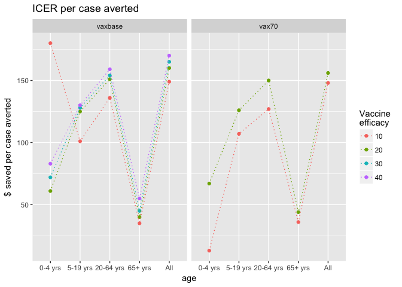
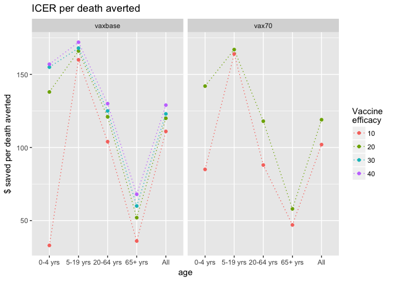
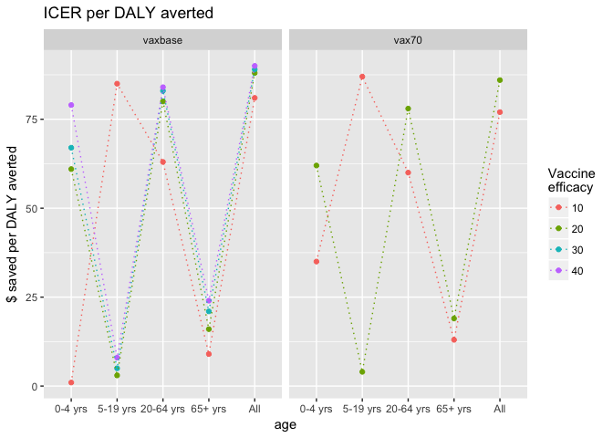

```r
rm(list = ls(all.names = TRUE))
library(ggplot2)
library(tidyr)
```


```r
df <- read.csv("~/git/economic-influenza/df/icer-all.csv")

df$age <- factor(df$age, levels = c("0-4 yrs", "5-19 yrs", "20-64 yrs", "65+ yrs", "All"))
df$risk <- factor(df$risk, levels = c("High", "Non-high", "All"))
df$scenario <- factor(df$scenario, levels = c("vaxbase", "vax6667", "vax7777", "vax7778"))
df$v.eff <- factor(df$v.eff)
df$icer.case.averted <- as.integer(df$icer.case.averted)
df$icer.death.averted <- as.integer(df$icer.death.averted)
df$icer.daly.averted <- as.integer(df$icer.daly.averted)

# subset risk = all
group_df <- df[(df$risk=="All"),]
```

# ICER sensitivity analysis


```r
# icer per case averted
ggplot(group_df, aes(x = age, y = icer.case.averted, color = v.eff, group = v.eff)) + labs(color = "Vaccine \nefficacy") +
  geom_point() + geom_line(linetype = "dotted") + ylab("$ saved per case averted") +
  facet_grid(~ scenario) + ggtitle("ICER per case averted")
```

<!-- -->

```r
# icer per death averted
ggplot(group_df, aes(x = age, y = icer.death.averted, color = v.eff, group = v.eff)) + labs(color = "Vaccine \nefficacy") +
  geom_point() + geom_line(linetype = "dotted") + ylab("$ saved per death averted") +
  facet_grid(~ scenario)+ ggtitle("ICER per death averted")
```

<!-- -->

```r
# icer per daly averted
ggplot(group_df, aes(x = age, y = icer.daly.averted, color = v.eff, group = v.eff)) + labs(color = "Vaccine \nefficacy") +
  geom_point() + geom_line(linetype = "dotted") + ylab("$ saved per DALY averted") +
  facet_grid(~ scenario) + ggtitle("ICER per DALY averted")
```

<!-- -->


```r
#
ggplot(group_df, aes(x = age, y = icer.case.averted, color = v.eff, group = v.eff)) + labs(color = "Vaccine \nefficacy") +
  geom_point() + geom_line(linetype = "dotted") + ylab("$ saved per case averted") +
  facet_grid(v.eff ~ scenario) + ggtitle("ICER per case averted")
```

<!-- -->

```r
#
ggplot(group_df, aes(x = age, y = icer.death.averted, color = v.eff, group = v.eff)) + labs(color = "Vaccine \nefficacy") +
  geom_point() + geom_line(linetype = "dotted") + ylab("$ saved per death averted") +
  facet_grid(v.eff ~ scenario) + ggtitle("ICER per death averted")
```

<!-- -->

```r
#
ggplot(group_df, aes(x = age, y = icer.daly.averted, color = v.eff, group = v.eff)) + labs(color = "Vaccine \nefficacy") +
  geom_point() + geom_line(linetype = "dotted") + ylab("$ saved per DALY averted") +
  facet_grid(v.eff ~ scenario) + ggtitle("ICER per DALY averted")
```

<!-- -->


