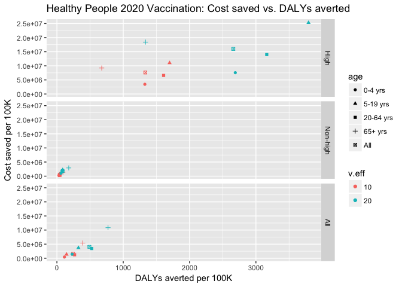

```r
rm(list = ls(all.names = TRUE))
library(ggplot2)
library(tidyr)
library(dplyr)
```

```
## 
## Attaching package: 'dplyr'
```

```
## The following objects are masked from 'package:stats':
## 
##     filter, lag
```

```
## The following objects are masked from 'package:base':
## 
##     intersect, setdiff, setequal, union
```

```r
library(knitr)
library(rmarkdown)
library(formatR)
```


```r
data <- read.csv("df/icer-all.csv", as.is = TRUE)
df <- data[(data$reference == "vaxbase"), ]

df$cost.diff.per100k <- as.numeric(df$cost.diff.per100k)
df$cases.averted <- as.numeric(df$cases.averted)
df$cases.averted.per100k <- as.numeric(df$cases.averted.per100k)
df$icer.case.averted <- as.numeric(df$icer.case.averted)
df$deaths.averted <- as.numeric(df$deaths.averted)
df$deaths.averted.per100k <- as.numeric(df$deaths.averted.per100k)
df$icer.death.averted <- as.numeric(df$icer.death.averted)
df$dalys <- as.numeric(df$dalys)
df$dalys.per100k <- as.numeric(df$dalys.per100k)
df$dalys.averted <- as.numeric(df$dalys.averted)
df$dalys.averted.per100k <- as.numeric(df$dalys.averted.per100k)
df$icer.daly.averted <- as.numeric(df$icer.daly.averted)
```


```r
# factors
df$age <- factor(df$age, levels = c("0-4 yrs", "5-19 yrs", "20-64 yrs", "65+ yrs", 
    "All"))
df$risk <- factor(df$risk, levels = c("High", "Non-high", "All"))
df$scenario <- factor(df$scenario, levels = c("vaxbase", "vax70"))
df$v.eff <- factor(df$v.eff)
```

# Tables


```r
## Table: ICERs.
t1 <- df[c("scenario", "age", "risk", "v.eff", "icer.case.averted", "icer.death.averted", 
    "icer.daly.averted")] %>% gather("icer.case.averted", "icer.death.averted", 
    "icer.daly.averted", key = "icer", value = "value") %>% spread(risk, value) %>% 
    arrange(scenario, v.eff, icer)
head(t1)
```

```
##   scenario       age v.eff              icer     High   Non-high       All
## 1    vax70   0-4 yrs    10 icer.case.averted 1313.848   85.83691  164.4296
## 2    vax70  5-19 yrs    10 icer.case.averted 2863.927  180.21990  351.9771
## 3    vax70 20-64 yrs    10 icer.case.averted 2063.600  103.92250  386.1160
## 4    vax70   65+ yrs    10 icer.case.averted 5149.016  765.08850 3009.6600
## 5    vax70       All    10 icer.case.averted 2707.971  141.18400  501.0614
## 6    vax70   0-4 yrs    10 icer.daly.averted 2603.880 7474.37800 3820.2260
```

```r
# write.csv(t1, 'df/df2-icer.csv')

## Table: Cases, deaths, DALYs per 100,000 population.
t2 <- df[c("scenario", "age", "risk", "v.eff", "cases.per100k", "deaths.per100k", 
    "dalys.per100k")] %>% gather("cases.per100k", "deaths.per100k", "dalys.per100k", 
    key = "metric", value = "value") %>% spread(risk, value) %>% arrange(scenario, 
    v.eff, metric)
head(t2)
```

```
##   scenario       age v.eff        metric     High Non-high      All
## 1    vax70   0-4 yrs    10 cases.per100k 25524.08 25524.08 25524.08
## 2    vax70  5-19 yrs    10 cases.per100k 53760.39 53760.38 53760.38
## 3    vax70 20-64 yrs    10 cases.per100k 23676.19 23676.19 23676.19
## 4    vax70   65+ yrs    10 cases.per100k 16838.77 16838.77 16838.77
## 5    vax70       All    10 cases.per100k 24008.58 29724.42 28826.70
## 6    vax70   0-4 yrs    10 dalys.per100k 12878.57   293.12  1098.59
```

```r
# write.csv(t2, 'df/df2-rates.csv')

## Table: Cases, deaths, DALYs averted per 100,000
t3 <- df[c("scenario", "age", "risk", "v.eff", "cases.averted.per100k", "deaths.averted.per100k", 
    "dalys.averted.per100k")] %>% gather("cases.averted.per100k", "deaths.averted.per100k", 
    "dalys.averted.per100k", key = "metric", value = "value") %>% spread(risk, 
    value) %>% arrange(scenario, v.eff, metric)
head(t3)
```

```
##   scenario       age v.eff                metric    High Non-high     All
## 1    vax70   0-4 yrs    10 cases.averted.per100k 2627.37  2627.37 2627.37
## 2    vax70  5-19 yrs    10 cases.averted.per100k 3851.28  3851.28 3851.28
## 3    vax70 20-64 yrs    10 cases.averted.per100k 3195.21  3195.21 3195.21
## 4    vax70   65+ yrs    10 cases.averted.per100k 1790.48  1790.48 1790.48
## 5    vax70       All    10 cases.averted.per100k 2815.48  3216.95 3153.90
## 6    vax70   0-4 yrs    10 dalys.averted.per100k 1325.70    30.17  113.09
```

```r
# write.csv(t3, 'df/df2-averted-rates.csv')
```

# Subset data.

```r
# subset scenario
df_10 <- df[(df$v.eff == "10"), ]
df_20 <- df[(df$v.eff == "20"), ]

# age groups
age_df_10 <- df_10[(df_10$risk == "All"), ]
age_df_20 <- df_20[(df_20$risk == "All"), ]

# risk groups
risk_df_10 <- df_10[!(df_10$age == "All"), ]
risk_df_20 <- df_20[!(df_20$age == "All"), ]
```

# Fig. Cost saved vs. DALYs averted

```r
a1 <- ggplot(df_10, aes(x = dalys.averted.per100k, y = cost.diff.per100k)) + 
    labs(x = "DALYs averted per 100K", y = "Cost saved per 100K", title = "Healthy People 2020 Vaccination (10% VE): Cost saved vs. DALYs averted")

a1 + aes(color = risk, group = risk) + geom_point() + facet_grid(~age)
```

<!-- -->

```r
a1 + aes(color = age, group = age) + geom_point() + facet_grid(~risk)
```

<!-- -->


```r
a2 <- ggplot(df_20, aes(x = dalys.averted.per100k, y = cost.diff.per100k)) + 
    labs(x = "DALYs averted per 100K", y = "Cost saved per 100K", title = "Healthy People 2020 Vaccination (20% VE): Cost saved vs. DALYs averted")

a2 + aes(color = risk, group = risk) + geom_point() + facet_grid(~age)
```

<!-- -->

```r
a2 + aes(color = age, group = age) + geom_point() + facet_grid(~risk)
```

<!-- -->


```r
b <- ggplot(df, aes(x = dalys.averted.per100k, y = cost.diff.per100k)) + labs(x = "DALYs averted per 100K", 
    y = "Cost saved per 100K", title = "Healthy People 2020 Vaccination: Cost saved vs. DALYs averted")

b + aes(color = v.eff, group = v.eff, shape = risk) + geom_point() + facet_grid(~age)
```

<!-- -->

```r
b + aes(color = v.eff, group = v.eff, shape = age) + geom_point() + facet_grid(risk ~ 
    .)
```

<!-- -->

