```
## 
## Attaching package: 'dplyr'
```

```
## The following objects are masked from 'package:stats':
## 
##     filter, lag
```

```
## The following objects are masked from 'package:base':
## 
##     intersect, setdiff, setequal, union
```


# Tables


# Subset data.


## 20% VE: $ per case averted
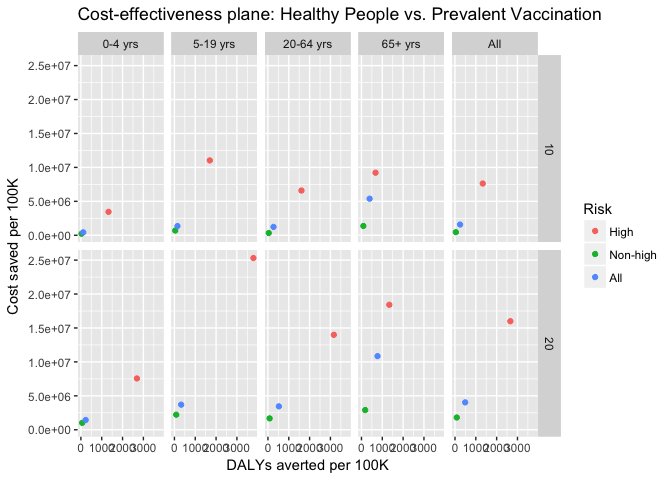<!-- -->


## 20% VE: $ per death averted
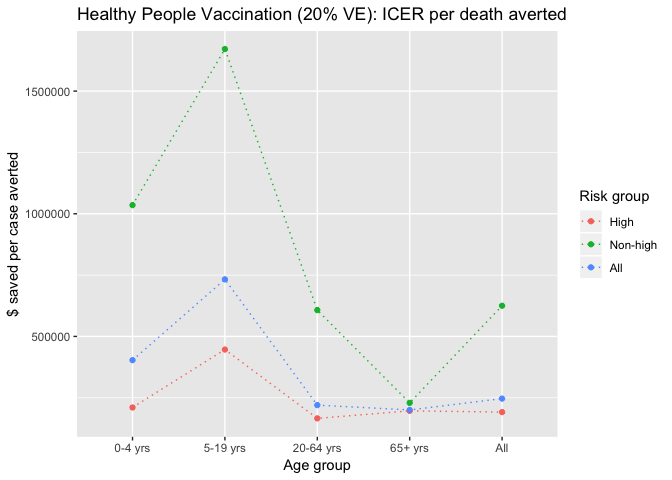<!-- -->

## 20% VE: $ per DALY averted
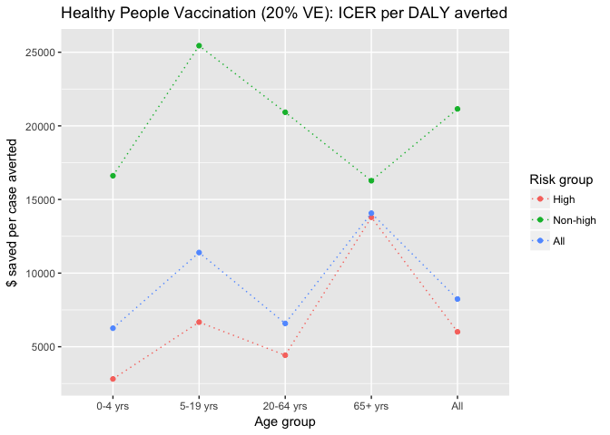<!-- -->

## 20% VE: Cases, cases averted
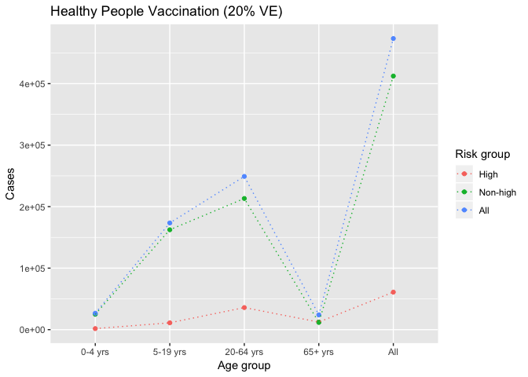<!-- --><!-- -->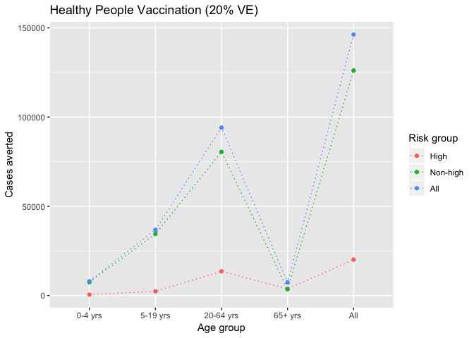<!-- -->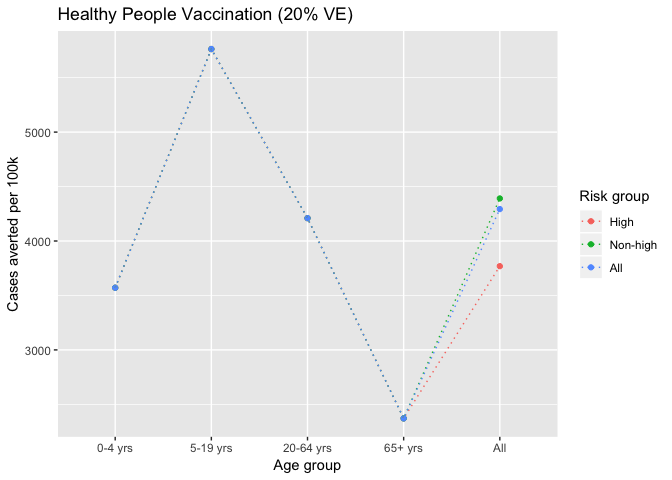<!-- -->

## 20% VE: Deaths, deaths averted
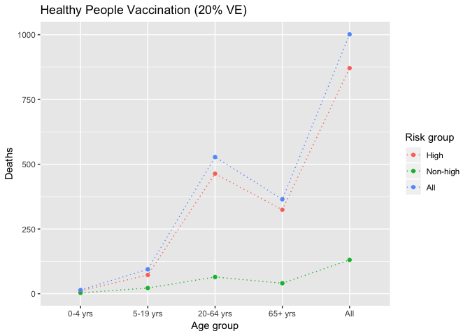<!-- --><!-- -->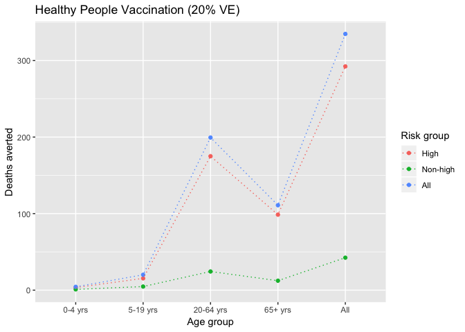<!-- -->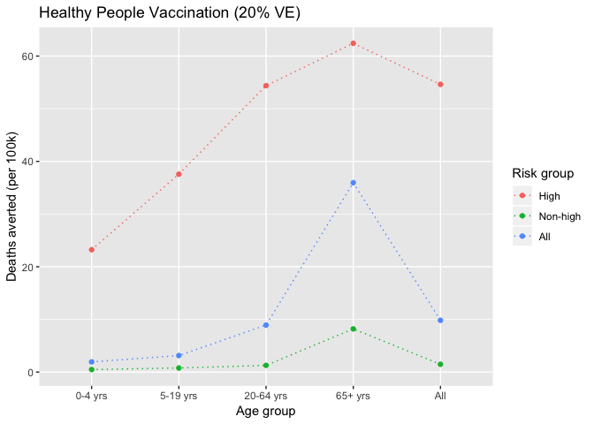<!-- -->

## 20% VE: DALYs, DALYs averted
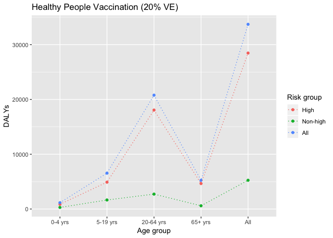<!-- -->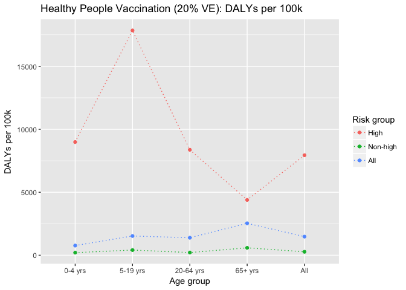<!-- -->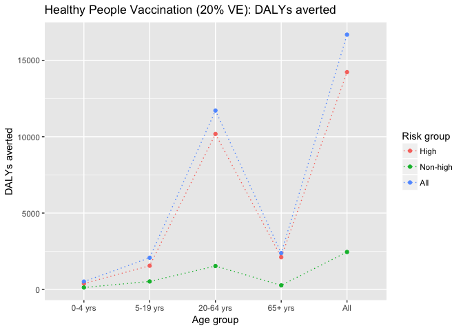<!-- -->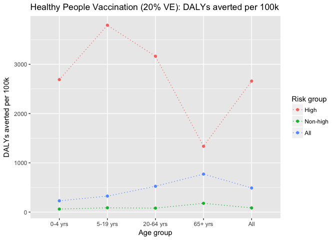<!-- -->

## Cost-effectiveness plane: HP vs. PV

<!-- -->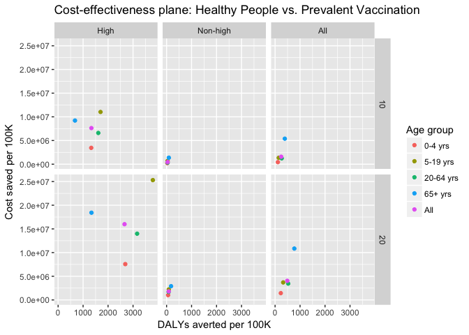<!-- -->

## EXTRA: Cost-effectiveness plane (10% and 20% VE)

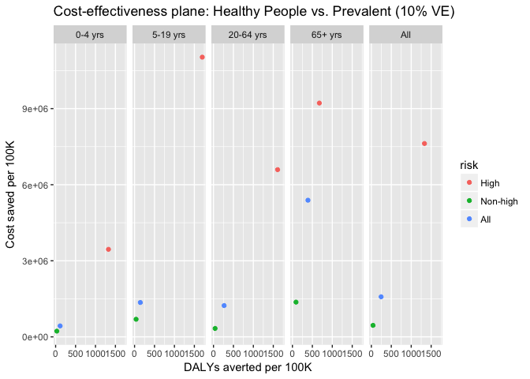<!-- --><!-- -->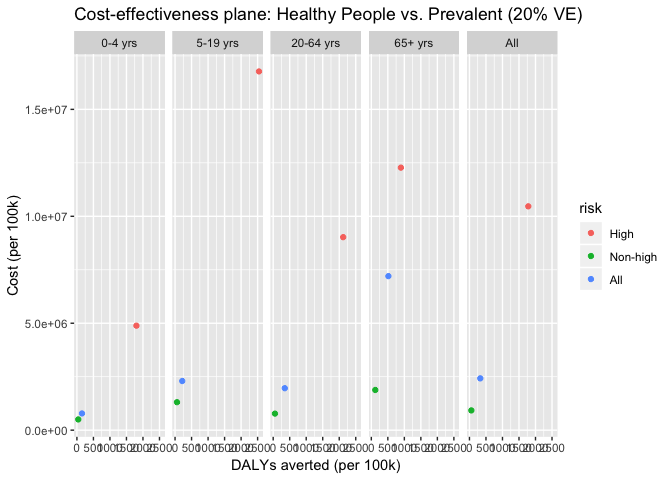<!-- --><!-- -->


## EXTRA: Combine HP 20% + PV 40%


## EXTRA: HP 20% and PV 40%: ICERs


## EXTRA: HP 20% and PV 40%: Cases


## EXTRA: HP 20% and PV 40%: Deaths


## EXTRA: HP 20% and PV 40%: DALYs


