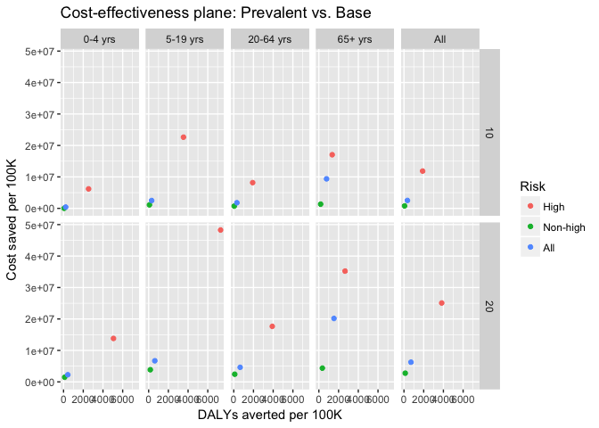
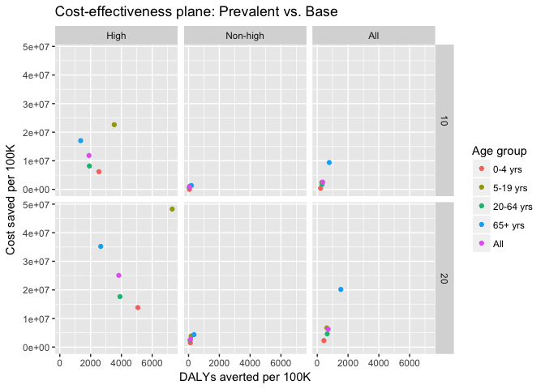
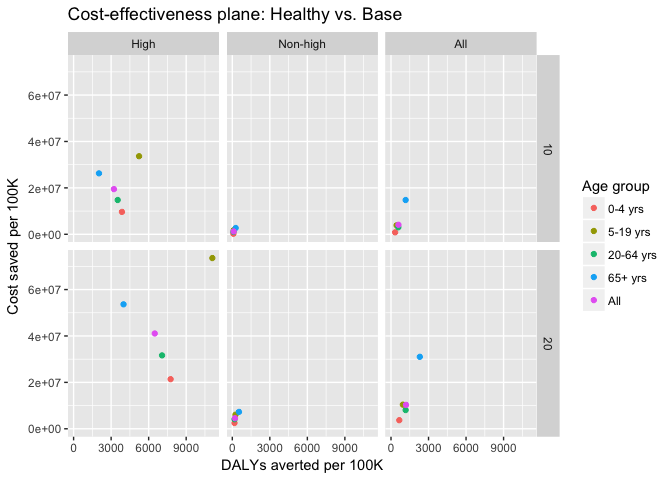
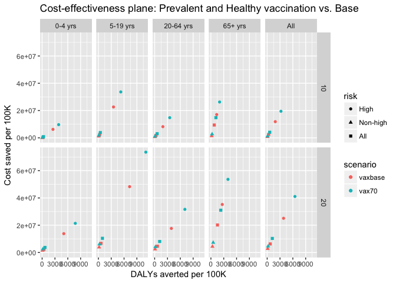
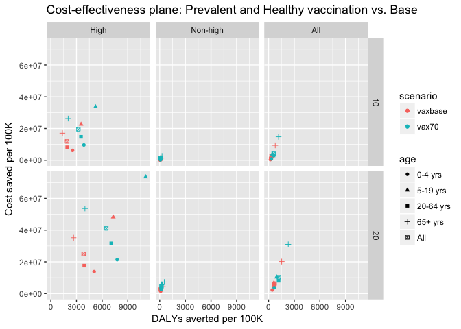

```
## 
## Attaching package: 'dplyr'
```

```
## The following objects are masked from 'package:stats':
## 
##     filter, lag
```

```
## The following objects are masked from 'package:base':
## 
##     intersect, setdiff, setequal, union
```


# Subset data.


# Fig. Cost-effectiveness plane

# Prevalent vax (All VE) vs. No vax

<!-- --><!-- -->

# Healthy vax (All VE) vs. No vax

<!-- --><!-- -->

# Prevalent and Healthy (All VE) vs. No vax

<!-- --><!-- -->

## Prevalent and Healthy vs. No vax

<!-- --><!-- --><!-- --><!-- -->


