```r
rm(list = ls(all.names = TRUE))
library(ggplot2)
library(tidyr)
library(dplyr)
library(knitr)
library(rmarkdown)
library(formatR)
```


```r
data <- read.csv("df/icer-all.csv", as.is = TRUE)
df <- data[(data$scenario!="base"),]

df$cases.averted <- as.numeric(df$cases.averted)
df$cases.averted.per100k <- as.numeric(df$cases.averted.per100k)
df$icer.case.averted <- as.numeric(df$icer.case.averted)
df$deaths.averted <- as.numeric(df$deaths.averted)
df$deaths.averted.per100k <- as.numeric(df$ deaths.averted.per100k)
df$icer.death.averted <- as.numeric(df$icer.death.averted)
df$dalys <- as.numeric(df$dalys)
df$dalys.per100k <- as.numeric(df$dalys.per100k)
df$dalys.averted <- as.numeric(df$dalys.averted)
df$dalys.averted.per100k <- as.numeric(df$dalys.averted.per100k)
df$icer.daly.averted <- as.numeric(df$icer.daly.averted)
```


```r
# subset relevant efficacies
df2 <- df[!(df$scenario == 'vaxbase' & df$v.eff %in% c(50, 60)),]
#table(df2$v.eff, useNA = 'always')

df3 <- df2[!(df2$scenario == 'vax70' & df2$v.eff %in% c(30,40)), ]
#table(df3$scenario, df3$v.eff, useNA = 'always')

# factors
df3$age <- factor(df3$age, levels = c("0-4 yrs", "5-19 yrs", "20-64 yrs", "65+ yrs", "All"))
df3$risk <- factor(df3$risk, levels = c("High", "Non-high", "All"))
df3$scenario <- factor(df3$scenario, levels = c("vaxbase", "vax70"))
df3$v.eff <- factor(df3$v.eff)
```

# Tables


Subset data.

```r
# subset scenario
df_base <- df3[(df3$scenario == 'vaxbase'),]
df_vax70 <- df3[(df3$scenario == 'vax70'),]

# age groups
age_df_base <- df_base[(df_base$risk == "All"),]
age_df_vax70 <- df_vax70[(df_vax70$risk == "All"),]

# risk groups
risk_df_base <- df_base[!(df_base$age == 'All'),]
risk_df_vax70 <- df_vax70[!(df_vax70$age == 'All'),]
```

# Base Vaccination Scenario

## Fig. ICER per case averted

```r
ggplot(age_df_base, aes(x = age, y = icer.case.averted, color = v.eff, group = v.eff)) + 
    geom_point() + geom_line(linetype = "dotted") + labs(x = "Age group", color = "Vaccine \nefficacy") + 
    ylab("$ saved per case averted") + ggtitle("Base Vaccination: ICER per case averted")
```

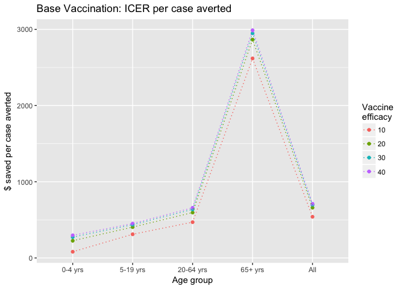<!-- -->

```r
ggplot(df_base[(df_base$age == "All"), ], aes(x = v.eff, y = icer.case.averted, 
    group = risk, color = risk)) + geom_point() + geom_line(linetype = "dotted") + 
    labs(x = "Vaccine efficacy (%)", color = "Risk") + ylab("$ saved per case averted") + 
    ggtitle("Base Vaccination: ICER per case averted")
```

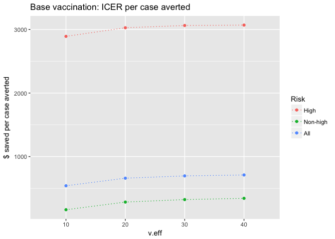<!-- -->

```r
ggplot(df_base, aes(x = age, y = icer.case.averted, group = risk, color = risk)) + 
    geom_point() + geom_line(linetype = "dotted") + labs(x = "Age group", color = "Risk group") + 
    ylab("$ saved per case averted") + ggtitle("Base Vaccination: ICER per case averted") + 
    facet_grid(~v.eff)
```

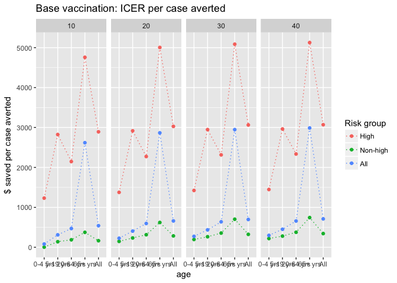<!-- -->

## Fig. ICER per death averted

```r
ggplot(age_df_base, aes(x = age, y = icer.death.averted, color = v.eff, group = v.eff)) + 
    geom_point() + geom_line(linetype = "dotted") + labs(x = "Age group", color = "Vaccine \nefficacy") + 
    ylab("$ saved per death averted") + ggtitle("Base Vaccination: ICER per death averted")
```

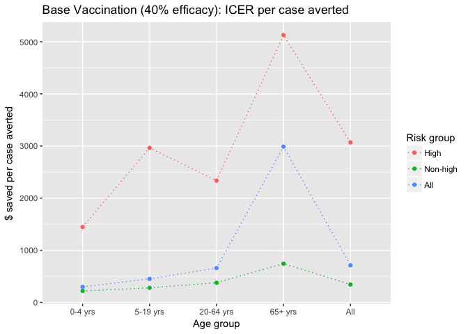<!-- -->

```r
ggplot(df_base[(df_base$age == "All"), ], aes(x = v.eff, y = icer.death.averted, 
    group = risk, color = risk)) + geom_point() + geom_line(linetype = "dotted") + 
    labs(x = "Vaccine efficacy (%)", color = "Risk") + ylab("$ saved per death averted") + 
    ggtitle("Base Vaccination: ICER per death averted")
```

<!-- -->

```r
ggplot(df_base, aes(x = age, y = icer.death.averted, group = risk, color = risk)) + 
    geom_point() + geom_line(linetype = "dotted") + labs(x = "Age group", color = "Risk group") + 
    ylab("$ saved per death averted") + ggtitle("Base Vaccination: ICER per death averted") + 
    facet_grid(~v.eff)
```

<!-- -->

## Fig. ICER per DALY averted

```r
ggplot(age_df_base, aes(x = age, y = icer.daly.averted, color = v.eff, group = v.eff)) + 
    geom_point() + geom_line(linetype = "dotted") + labs(x = "Age group", color = "Vaccine \nefficacy") + 
    ylab("$ saved per DALY averted") + ggtitle("Base Vaccination: ICER per DALY averted")
```

<!-- -->

```r
ggplot(df_base[(df_base$age == "All"), ], aes(x = v.eff, y = icer.daly.averted, 
    group = risk, color = risk)) + geom_point() + geom_line(linetype = "dotted") + 
    labs(x = "Vaccine efficacy (%)", color = "Risk") + ylab("$ saved per DALY averted") + 
    ggtitle("Base Vaccination: ICER per DALY averted")
```

<!-- -->

```r
ggplot(df_base, aes(x = age, y = icer.daly.averted, group = risk, color = risk)) + 
    geom_point() + geom_line(linetype = "dotted") + labs(x = "Age group", color = "Risk group") + 
    ylab("$ saved per DALY averted") + ggtitle("Base Vaccination: ICER per DALY averted") + 
    facet_grid(~v.eff)
```

<!-- -->

Set up plots.

```r
# age
g1 <- ggplot(age_df_base, aes(x = age, group = v.eff, color = v.eff)) + geom_point() + 
    geom_line(linetype = "dotted") + labs(x = "Age group", color = "Vaccine \nefficacy")
# risk
g2 <- ggplot(df_base[(df_base$age == "All"), ], aes(x = v.eff, group = risk, 
    color = risk)) + geom_point() + geom_line(linetype = "dotted") + labs(x = "Vaccine efficacy", 
    color = "Risk group")

g3 <- ggplot(risk_df_base, aes(x = age, group = risk, color = risk)) + geom_point() + 
    geom_line(linetype = "dotted") + labs(x = "Age group", color = "Risk group") + 
    facet_grid(~v.eff)
```

## Fig. Cases, cases averted

```r
# age groups
g1 + aes(y = cases) + labs(y = "Cases", title = "Base Vaccination: Cases")
```

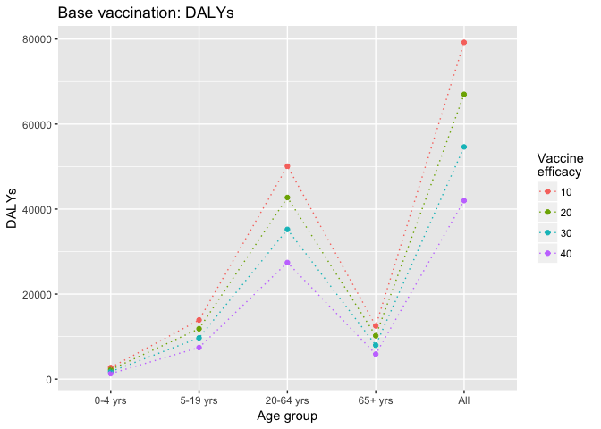<!-- -->

```r
g1 + aes(y = cases.per100k) + labs(y = "Cases per 100k", title = "Base Vaccination: Cases per 100k")
```

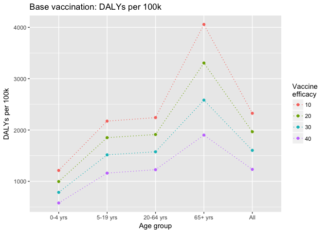<!-- -->

```r
g1 + aes(y = cases.averted) + labs(y = "Cases averted", title = "Base Vaccination: Cases averted")
```

<!-- -->

```r
g1 + aes(y = cases.averted.per100k) + labs(y = "Cases averted per 100k", title = "Base Vaccination: Cases averted per 100k")
```

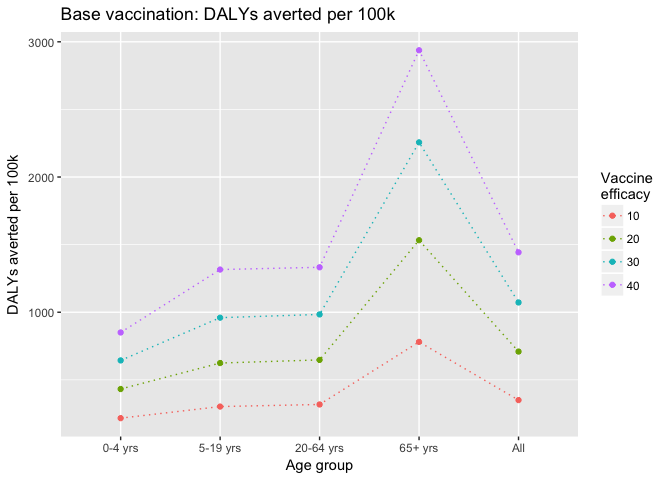<!-- -->

```r
# risk groups
g2 + aes(y = cases) + labs(y = "Cases", title = "Base Vaccination: Cases")
```

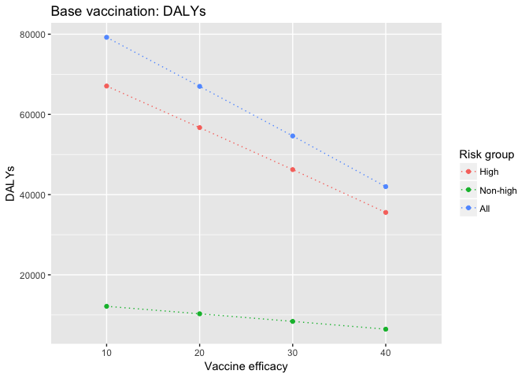<!-- -->

```r
g2 + aes(y = cases.per100k) + labs(y = "Cases per 100k", title = "Base Vaccination: Cases per 100k")
```

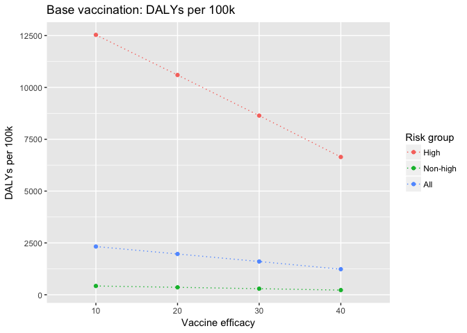<!-- -->

```r
g2 + aes(y = cases.averted) + labs(y = "Cases averted", title = "Base Vaccination: Cases averted")
```

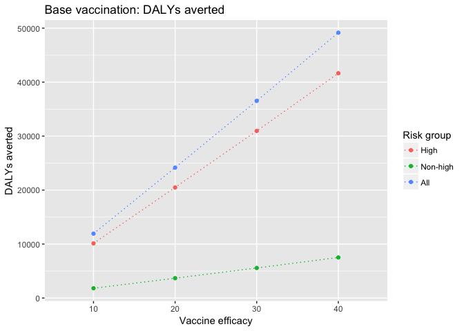<!-- -->

```r
g2 + aes(y = cases.averted.per100k) + labs(y = "Cases averted per 100k", title = "Base Vaccination: Cases averted per 100k")
```

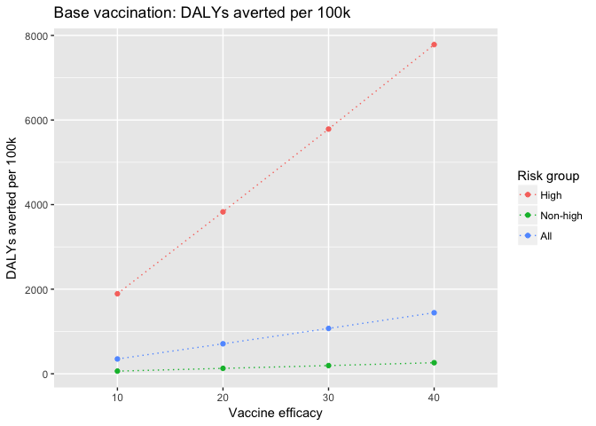<!-- -->

```r
g3 + aes(y = cases) + labs(y = "Cases", title = "Base Vaccination: Cases")
```

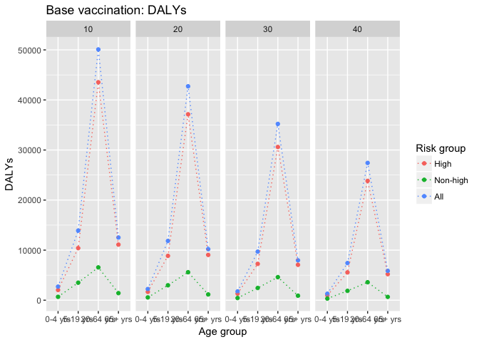<!-- -->

```r
g3 + aes(y = cases.per100k) + labs(y = "Cases per 100k", title = "Base Vaccination: Cases per 100k")
```

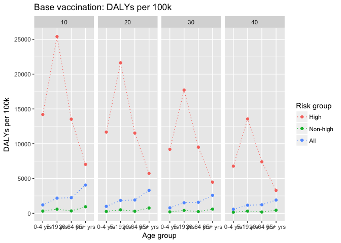<!-- -->

```r
g3 + aes(y = cases.averted) + labs(y = "Cases averted", title = "Base Vaccination: Cases averted")
```

<!-- -->

```r
g3 + aes(y = cases.averted.per100k) + labs(y = "Cases averted per 100k", title = "Base Vaccination: Cases averted per 100k")
```

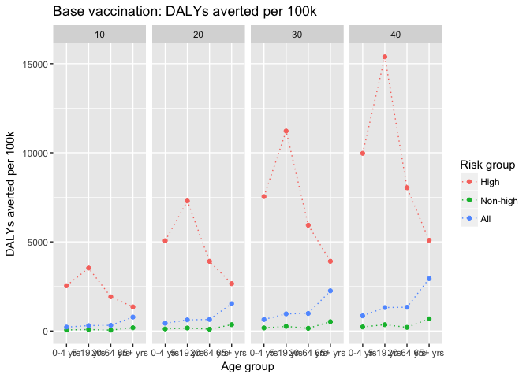<!-- -->

## Fig. Deaths, deaths averted

```r
# age groups
g1 + aes(y = deaths) + labs(y = "Deaths", title = "Base Vaccination: Deaths")
```

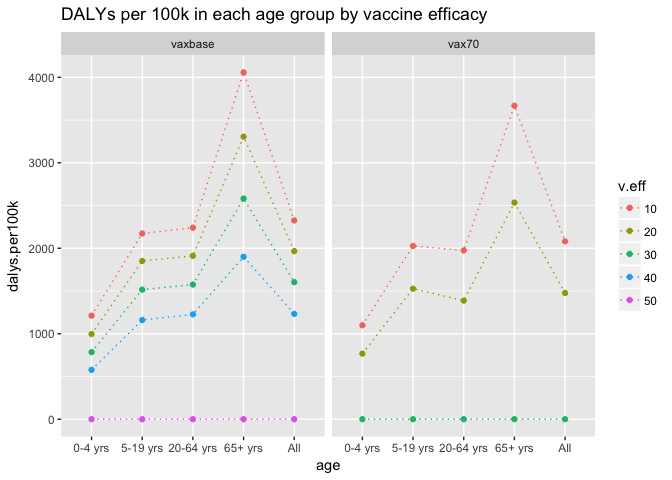<!-- -->

```r
g1 + aes(y = deaths.per100k) + labs(y = "Deaths per 100k", title = "Base Vaccination: Deaths per 100k")
```

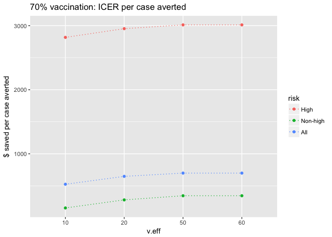<!-- -->

```r
g1 + aes(y = deaths.averted) + labs(y = "Deaths averted", title = "Base Vaccination: Deaths averted")
```

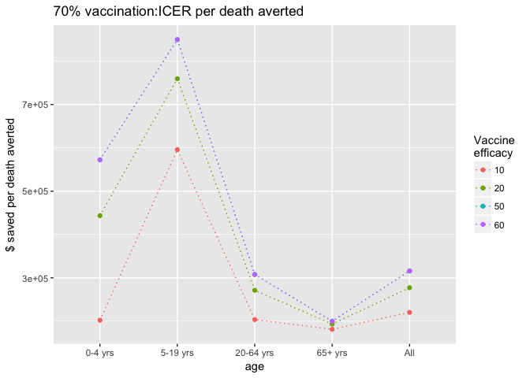<!-- -->

```r
g1 + aes(y = deaths.averted.per100k) + labs(y = "Deaths averted per 100k", title = "Base Vaccination: Deaths averted per 100k")
```

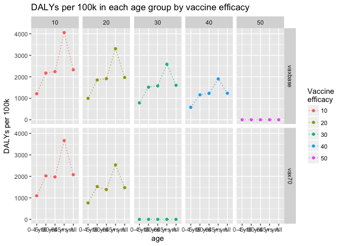<!-- -->

```r
# risk groups
g2 + aes(y = deaths) + labs(y = "Deaths", title = "Base Vaccination: Deaths")
```

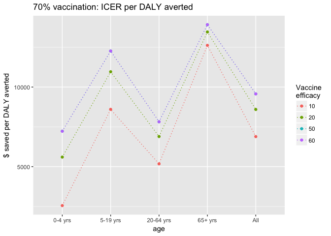<!-- -->

```r
g2 + aes(y = deaths.per100k) + labs(y = "Deaths per 100k", title = "Base Vaccination: Deaths per 100k")
```

<!-- -->

```r
g2 + aes(y = deaths.averted) + labs(y = "Deaths averted", title = "Base Vaccination: Deaths averted")
```

<!-- -->

```r
g2 + aes(y = deaths.averted.per100k) + labs(y = "Deaths averted per 100k", title = "Base Vaccination: Deaths averted per 100k")
```

<!-- -->

```r
g3 + aes(y = deaths) + labs(y = "Deaths", title = "Base Vaccination: Deaths")
```

<!-- -->

```r
g3 + aes(y = deaths.per100k) + labs(y = "Deaths per 100k", title = "Base Vaccination: Deaths per 100k")
```

<!-- -->

```r
g3 + aes(y = deaths.averted) + labs(y = "Deaths averted", title = "Base Vaccination: Deaths averted")
```

<!-- -->

```r
g3 + aes(y = deaths.averted.per100k) + labs(y = "Deaths averted per 100k", title = "Base Vaccination: Deaths averted per 100k")
```

<!-- -->

## Fig. DALYs, DALYs averted

```r
# age groups
g1 + aes(y = dalys) + labs(y = "DALYs", title = "Base Vaccination: DALYs")
```

<!-- -->

```r
g1 + aes(y = dalys.per100k) + labs(y = "DALYs per 100k", title = "Base Vaccination: DALYs per 100k")
```

<!-- -->

```r
g1 + aes(y = dalys.averted) + labs(y = "DALYs averted", title = "Base Vaccination: DALYs averted")
```

<!-- -->

```r
g1 + aes(y = dalys.averted.per100k) + labs(y = "DALYs averted per 100k", title = "Base Vaccination: DALYs averted per 100k")
```

<!-- -->

```r
# risk groups
g2 + aes(y = dalys) + labs(y = "DALYs", title = "Base Vaccination: DALYs")
```

<!-- -->

```r
g2 + aes(y = dalys.per100k) + labs(y = "DALYs per 100k", title = "Base Vaccination: DALYs per 100k")
```

<!-- -->

```r
g2 + aes(y = dalys.averted) + labs(y = "DALYs averted", title = "Base Vaccination: DALYs averted")
```

<!-- -->

```r
g2 + aes(y = dalys.averted.per100k) + labs(y = "DALYs averted per 100k", title = "Base Vaccination: DALYs averted per 100k")
```

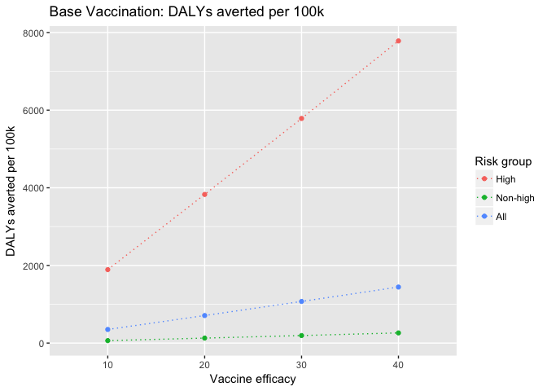<!-- -->

```r
g3 + aes(y = dalys) + labs(y = "DALYs", title = "Base Vaccination: DALYs")
```

<!-- -->

```r
g3 + aes(y = dalys.per100k) + labs(y = "DALYs per 100k", title = "Base Vaccination: DALYs per 100k")
```

<!-- -->

```r
g3 + aes(y = dalys.averted) + labs(y = "DALYs averted", title = "Base Vaccination: DALYs averted")
```

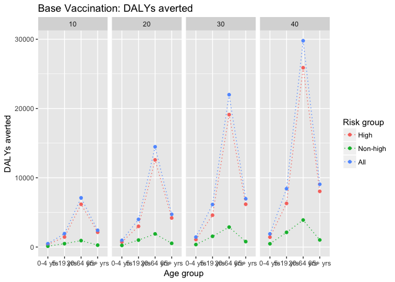<!-- -->

```r
g3 + aes(y = dalys.averted.per100k) + labs(y = "DALYs averted per 100k", title = "Base Vaccination: DALYs averted per 100k")
```

<!-- -->


# 70% Vaccination Scenario

## Fig. ICER per case averted

```r
g <- ggplot(df_vax70[(df_vax70$age == "All"), ], aes(x = v.eff, color = risk, 
    group = risk))
t1 <- labs(y = "$ saved per case averted", title = "70% Vaccination: ICER per case averted")
t2 <- labs(y = "$ saved per death averted", title = "70% Vaccination: ICER per death averted")
t3 <- labs(y = "$ saved per DALY averted", title = "70% Vaccination: ICER per DALY averted")

ggplot(age_df_vax70, aes(x = age, y = icer.case.averted, color = v.eff, group = v.eff)) + 
    geom_point() + geom_line(linetype = "dotted") + labs(x = "Age group", color = "Vaccine \nefficacy") + 
    t1
```

<!-- -->

```r
g + aes(y = icer.case.averted) + geom_point() + geom_line(linetype = "dotted") + 
    t1 + labs(x = "Vaccine efficacy (%)", color = "Risk group")
```

<!-- -->

```r
ggplot(df_vax70, aes(x = age, y = icer.case.averted, group = risk, color = risk)) + 
    geom_point() + geom_line(linetype = "dotted") + labs(color = "Risk group") + 
    ylab("$ saved per case averted") + ggtitle("70% Vaccination: ICER per case averted") + 
    facet_grid(~v.eff)
```

<!-- -->

## Fig. ICER per death averted

```r
ggplot(age_df_vax70, aes(x = age, y = icer.death.averted, color = v.eff, group = v.eff)) + 
    geom_point() + geom_line(linetype = "dotted") + labs(x = "Age group", color = "Vaccine \nefficacy") + 
    t2
```

<!-- -->

```r
g + aes(y = icer.death.averted) + geom_point() + geom_line(linetype = "dotted") + 
    t2 + labs(x = "Vaccine efficacy (%)", color = "Risk group")
```

<!-- -->

```r
ggplot(df_vax70, aes(x = age, y = icer.death.averted, group = risk, color = risk)) + 
    geom_point() + geom_line(linetype = "dotted") + labs(color = "Risk group") + 
    ylab("$ saved per death averted") + ggtitle("70% Vaccination: ICER per death averted") + 
    facet_grid(~v.eff)
```

<!-- -->

## Fig. ICER per DALY averted

```r
ggplot(age_df_vax70, aes(x = age, y = icer.daly.averted, color = v.eff, group = v.eff)) + 
    geom_point() + geom_line(linetype = "dotted") + labs(x = "Age group", color = "Vaccine \nefficacy") + 
    t3
```

<!-- -->

```r
g + aes(y = icer.daly.averted) + geom_point() + geom_line(linetype = "dotted") + 
    t3 + labs(x = "Vaccine efficacy (%)", color = "Risk group")
```

<!-- -->

```r
ggplot(df_vax70, aes(x = age, y = icer.daly.averted, group = risk, color = risk)) + 
    geom_point() + geom_line(linetype = "dotted") + labs(color = "Risk group") + 
    ylab("$ saved per DALY averted") + ggtitle("70% Vaccination: ICER per DALY averted") + 
    facet_grid(~v.eff)
```

<!-- -->

Set up plots.

```r
# age
h1 <- ggplot(age_df_vax70, aes(x = age, group = v.eff, color = v.eff)) + geom_point() + 
    geom_line(linetype = "dotted") + labs(x = "Age group", color = "Vaccine \nefficacy")
# risk
h2 <- ggplot(df_vax70[(df_vax70$age == "All"), ], aes(x = v.eff, group = risk, 
    color = risk)) + geom_point() + geom_line(linetype = "dotted") + labs(x = "Vaccine efficacy", 
    color = "Risk group")

h3 <- ggplot(risk_df_vax70, aes(x = age, group = risk, color = risk)) + geom_point() + 
    geom_line(linetype = "dotted") + labs(x = "Age group", color = "Risk group") + 
    facet_grid(~v.eff)
```

## Fig. Cases, cases averted

```r
# age groups
h1 + aes(y = cases) + labs(y = "Cases", title = "70% Vaccination: Cases")
```

<!-- -->

```r
h1 + aes(y = cases.per100k) + labs(y = "Cases per 100k", title = "70% Vaccination: Cases per 100k")
```

<!-- -->

```r
h1 + aes(y = cases.averted) + labs(y = "Cases averted", title = "70% Vaccination: Cases averted")
```

<!-- -->

```r
h1 + aes(y = cases.averted.per100k) + labs(y = "Cases averted per 100k", title = "70% Vaccination: Cases averted per 100k")
```

<!-- -->

```r
# risk groups
h2 + aes(y = cases) + labs(y = "Cases", title = "70% Vaccination: Cases")
```

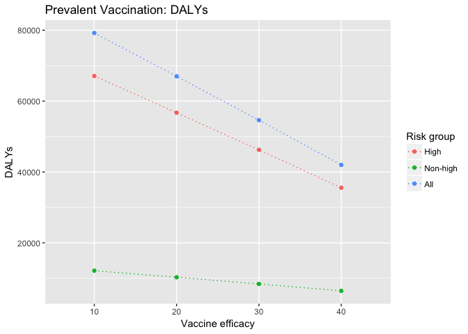<!-- -->

```r
h2 + aes(y = cases.per100k) + labs(y = "Cases per 100k", title = "70% Vaccination: Cases per 100k")
```

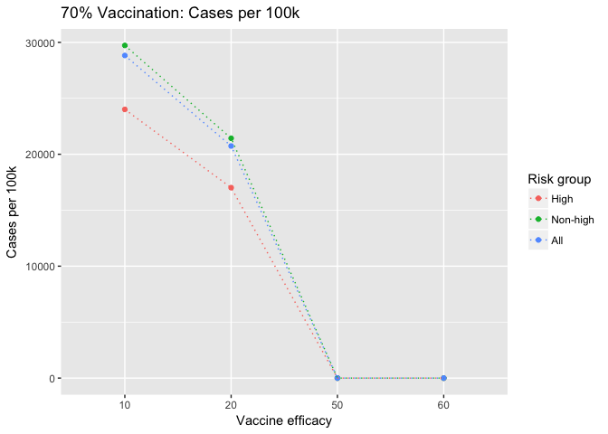<!-- -->

```r
h2 + aes(y = cases.averted) + labs(y = "Cases averted", title = "70% Vaccination: Cases averted")
```

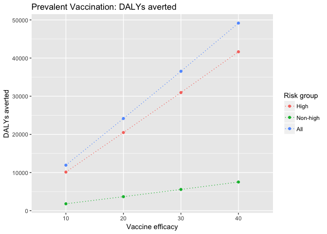<!-- -->

```r
h2 + aes(y = cases.averted.per100k) + labs(y = "Cases averted per 100k", title = "70% Vaccination: Cases averted per 100k")
```

<!-- -->

```r
h3 + aes(y = cases) + labs(y = "Cases", title = "70% Vaccination: Cases")
```

<!-- -->

```r
h3 + aes(y = cases.per100k) + labs(y = "Cases per 100k", title = "70% Vaccination: Cases per 100k")
```

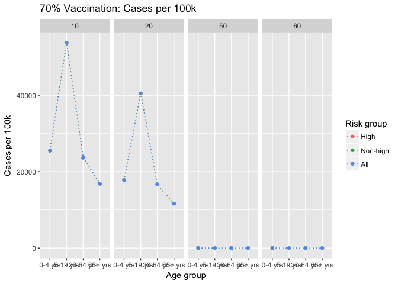<!-- -->

```r
h3 + aes(y = cases.averted) + labs(y = "Cases averted", title = "70% Vaccination: Cases averted")
```

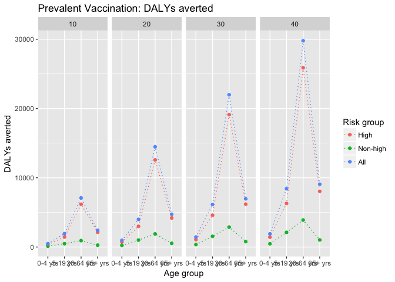<!-- -->

```r
h3 + aes(y = cases.averted.per100k) + labs(y = "Cases averted per 100k", title = "70% Vaccination: Cases averted per 100k")
```

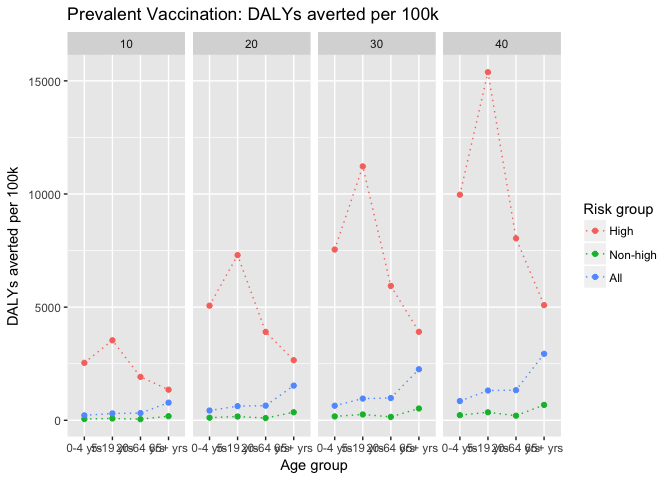<!-- -->

## Fig. Deaths, deaths averted

```r
# age groups
h1 + aes(y = deaths) + labs(y = "Deaths", title = "70% Vaccination: Deaths")
```

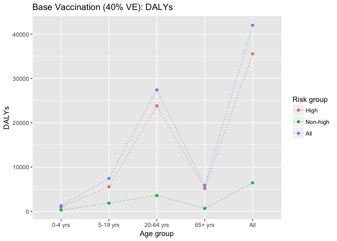<!-- -->

```r
h1 + aes(y = deaths.per100k) + labs(y = "Deaths per 100k", title = "70% Vaccination: Deaths per 100k")
```

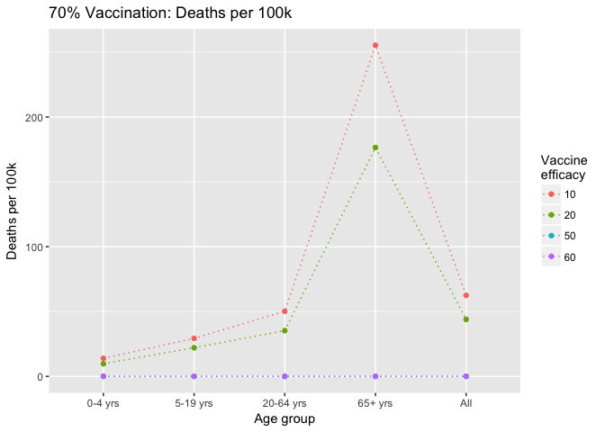<!-- -->

```r
h1 + aes(y = deaths.averted) + labs(y = "Deaths averted", title = "70% Vaccination: Deaths averted")
```

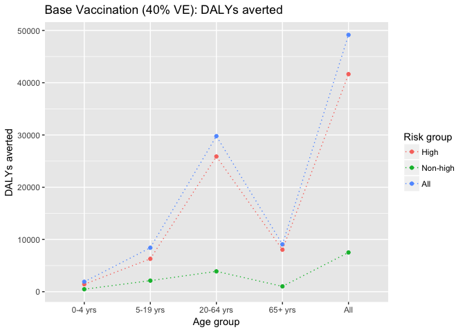<!-- -->

```r
h1 + aes(y = deaths.averted.per100k) + labs(y = "Deaths averted per 100k", title = "70% Vaccination: Deaths averted per 100k")
```

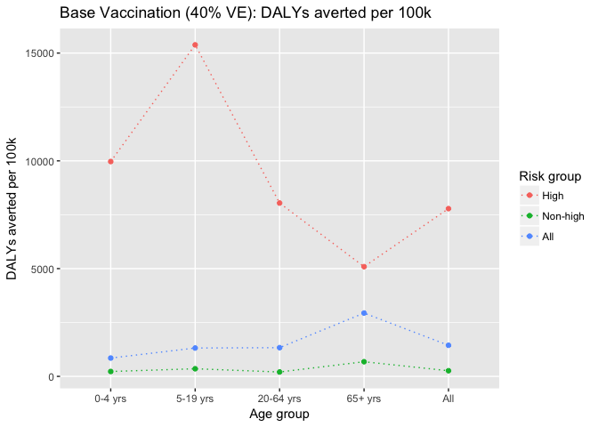<!-- -->

```r
# risk groups
h2 + aes(y = deaths) + labs(y = "Deaths", title = "70% Vaccination: Deaths")
```

<!-- -->

```r
h2 + aes(y = deaths.per100k) + labs(y = "Deaths per 100k", title = "70% Vaccination: Deaths per 100k")
```

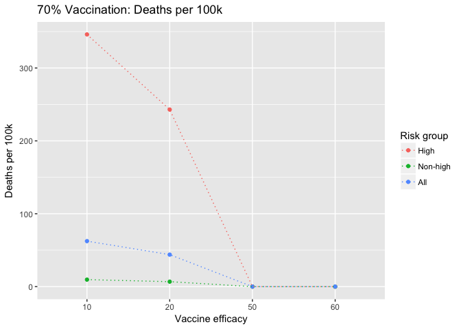<!-- -->

```r
h2 + aes(y = deaths.averted) + labs(y = "Deaths averted", title = "70% Vaccination: Deaths averted")
```

<!-- -->

```r
h2 + aes(y = deaths.averted.per100k) + labs(y = "Deaths averted per 100k", title = "70% Vaccination: Deaths averted per 100k")
```

<!-- -->

```r
h3 + aes(y = deaths) + labs(y = "Deaths", title = "70% Vaccination: Deaths")
```

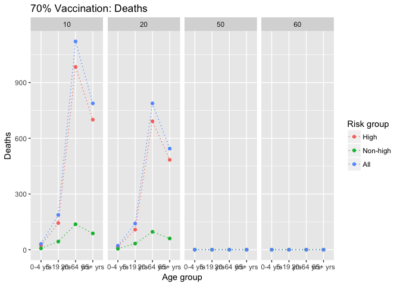<!-- -->

```r
h3 + aes(y = deaths.per100k) + labs(y = "Deaths per 100k", title = "70% Vaccination: Deaths per 100k")
```

<!-- -->

```r
h3 + aes(y = deaths.averted) + labs(y = "Deaths averted", title = "70% Vaccination: Deaths averted")
```

<!-- -->

```r
h3 + aes(y = deaths.averted.per100k) + labs(y = "Deaths averted per 100k", title = "70% Vaccination: Deaths averted per 100k")
```

<!-- -->

## Fig. DALYs, DALYs averted

```r
# age groups
h1 + aes(y = dalys) + labs(y = "DALYs", title = "70% Vaccination: DALYs")
```

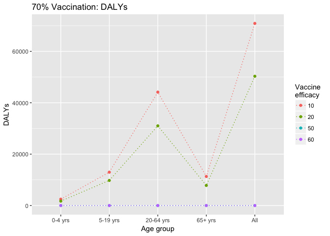<!-- -->

```r
h1 + aes(y = dalys.per100k) + labs(y = "DALYs per 100k", title = "70% Vaccination: DALYs per 100k")
```

<!-- -->

```r
h1 + aes(y = dalys.averted) + labs(y = "DALYs averted", title = "70% Vaccination: DALYs averted")
```

<!-- -->

```r
h1 + aes(y = dalys.averted.per100k) + labs(y = "DALYs averted per 100k", title = "70% Vaccination: DALYs averted per 100k")
```

<!-- -->

```r
# risk groups
h2 + aes(y = dalys) + labs(y = "DALYs", title = "70% Vaccination: DALYs")
```

<!-- -->

```r
h2 + aes(y = dalys.per100k) + labs(y = "DALYs per 100k", title = "70% Vaccination: DALYs per 100k")
```

<!-- -->

```r
h2 + aes(y = dalys.averted) + labs(y = "DALYs averted", title = "70% Vaccination: DALYs averted")
```

<!-- -->

```r
h2 + aes(y = dalys.averted.per100k) + labs(y = "DALYs averted per 100k", title = "70% Vaccination: DALYs averted per 100k")
```

<!-- -->

```r
h3 + aes(y = dalys) + labs(y = "DALYs", title = "70% Vaccination: DALYs")
```

<!-- -->

```r
h3 + aes(y = dalys.per100k) + labs(y = "DALYs per 100k", title = "70% Vaccination: DALYs per 100k")
```

<!-- -->

```r
h3 + aes(y = dalys.averted) + labs(y = "DALYs averted", title = "70% Vaccination: DALYs averted")
```

<!-- -->

```r
h3 + aes(y = dalys.averted.per100k) + labs(y = "DALYs averted per 100k", title = "70% Vaccination: DALYs averted per 100k")
```

<!-- -->

