```r
rm(list = ls(all.names = TRUE))
library(ggplot2); library(tidyr); library(dplyr)
library(knitr); library(rmarkdown)
```


```r
data <- read.csv("df/icer-all.csv", as.is = TRUE)
df <- data[(data$scenario!="base"),]

df$cases.averted <- as.numeric(df$cases.averted)
df$cases.averted.per100k <- as.numeric(df$cases.averted.per100k)
df$icer.case.averted <- as.numeric(df$icer.case.averted)
df$deaths.averted <- as.numeric(df$deaths.averted)
df$deaths.averted.per100k <- as.numeric(df$ deaths.averted.per100k)
df$icer.death.averted <- as.numeric(df$icer.death.averted)
df$dalys <- as.numeric(df$dalys)
df$dalys.per100k <- as.numeric(df$dalys.per100k)
df$dalys.averted <- as.numeric(df$dalys.averted)
df$dalys.averted.per100k <- as.numeric(df$dalys.averted.per100k)
df$icer.daly.averted <- as.numeric(df$icer.daly.averted)
```


```r
# subset relevant efficacies
df2 <- df[!(df$scenario == 'vaxbase' & df$v.eff %in% c(50, 60)),]
table(df2$v.eff, useNA = 'always')
```

```
## 
##   10   20   30   40   50   60 <NA> 
##   30   30   30   30   15   15    0
```

```r
df3 <- df2[!(df2$scenario == 'vax70' & df2$v.eff %in% c(30,40)), ]
table(df3$scenario, df3$v.eff, useNA = 'always')
```

```
##          
##           10 20 30 40 50 60 <NA>
##   vax70   15 15  0  0 15 15    0
##   vaxbase 15 15 15 15  0  0    0
##   <NA>     0  0  0  0  0  0    0
```

```r
# factors
df3$age <- factor(df3$age, levels = c("0-4 yrs", "5-19 yrs", "20-64 yrs", "65+ yrs", "All"))
df3$risk <- factor(df3$risk, levels = c("High", "Non-high", "All"))
df3$scenario <- factor(df3$scenario, levels = c("vaxbase", "vax70"))
df3$v.eff <- factor(df3$v.eff)

# subset
df_base <- df3[(df3$scenario == 'vaxbase'),]
df_vax70 <- df3[(df3$scenario == 'vax70'),]
```

# Table: ICERs.


# Table: Cases, deaths, DALYs per 100,000 population.


# Table: Cases, deaths, DALYs averted per 100,000


```r
# age groups
age_df_base <- df_base[(df_base$risk == "All"),]
age_df_vax70 <- df_vax70[(df_vax70$risk == "All"),]

# risk groups
risk_df_base <- df_base[!(df_base$age == 'All'),]
risk_df_vax70 <- df_vax70[!(df_vax70$age == 'All'),]
```

# Figure. ICERs.

```r
## Figure. Base vaccination: ICERs.
# icer per case averted
ggplot(age_df_base, aes(x = age, y = icer.case.averted, color = v.eff, group = v.eff)) +
  geom_point() + geom_line(linetype = "dotted") + labs(color = "Vaccine \nefficacy") +
  ylab("$ saved per case averted") + ggtitle("Base vaccination: ICER per case averted")
```

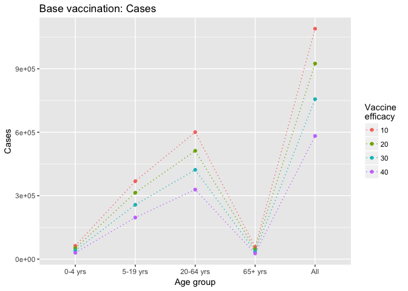<!-- -->

```r
# icer per death averted
ggplot(age_df_base, aes(x = age, y = icer.death.averted, color = v.eff, group = v.eff)) +
  geom_point() + geom_line(linetype = "dotted") + labs(color = "Vaccine \nefficacy") + 
  ylab("$ saved per death averted") + ggtitle("Base vaccination: ICER per death averted")
```

<!-- -->

```r
# icer per daly averted
ggplot(age_df_base, aes(x = age, y = icer.daly.averted, color = v.eff, group = v.eff)) +
  geom_point() + geom_line(linetype = "dotted") + labs(color = "Vaccine \nefficacy") + 
  ylab("$ saved per DALY averted") + ggtitle("Base vaccination: ICER per DALY averted")
```

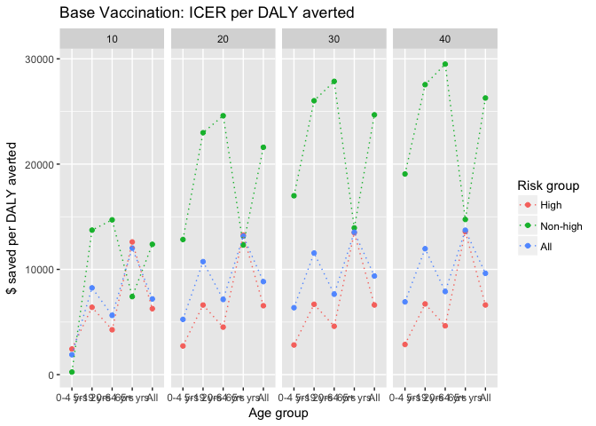<!-- -->

```r
#
ggplot(df_base[(df_base$age=="All"),], aes(x = v.eff, y = icer.case.averted, group = risk, color = risk)) +
  geom_point() + geom_line(linetype = "dotted") + labs(color = "Risk") +
  ylab("$ saved per case averted") + ggtitle("ICER per case averted")
```

<!-- -->

```r
ggplot(df_base[(df_base$age=="All"),], aes(x = v.eff, y = icer.death.averted, group = risk, color = risk)) +
  geom_point() + geom_line(linetype = "dotted") + labs(color = "Risk") +
  ylab("$ saved per death averted") + ggtitle("ICER per death averted")
```

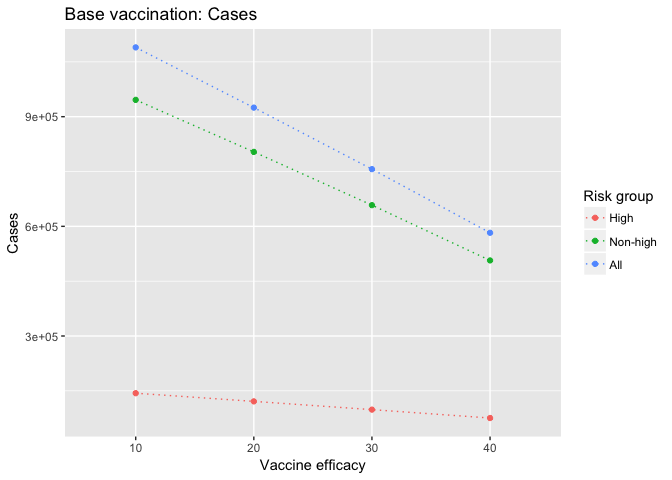<!-- -->

```r
ggplot(df_base[(df_base$age=="All"),], aes(x = v.eff, y = icer.daly.averted, group = risk, color = risk)) +
  geom_point() + geom_line(linetype = "dotted") + labs(color = "Risk") +
  ylab("$ saved per daly averted") + ggtitle("ICER per DALY averted")
```

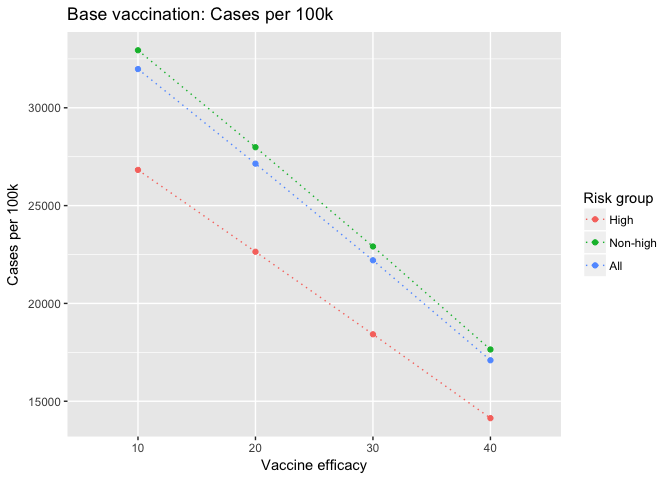<!-- -->


```r
## Figure. 70% Vaccination: ICERs.
g <- ggplot(df_vax70[(df_vax70$age=="All"),])
t1 <- labs(y = "$ saved per case averted", title = "70% vaccination: ICER per case averted")
t2 <- labs(y = "$ saved per death averted", title = "70% vaccination:ICER per death averted")
t3 <- labs(y = "$ saved per DALY averted", title = "70% vaccination: ICER per DALY averted")

# icer per case averted
ggplot(age_df_vax70, aes(x = age, y = icer.case.averted, color = v.eff, group = v.eff)) +
  geom_point() + geom_line(linetype = "dotted") + labs(color = "Vaccine \nefficacy") + t1
```

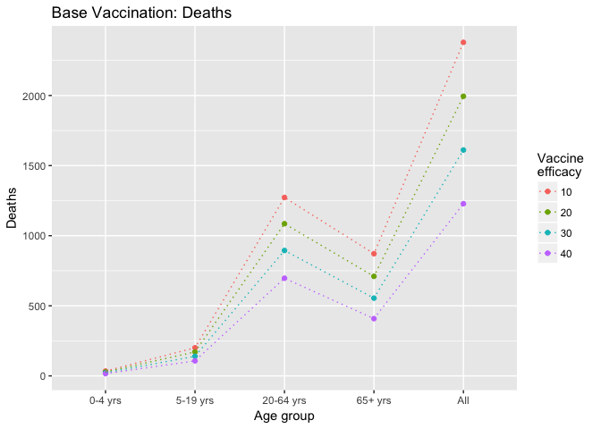<!-- -->

```r
# icer per death averted
ggplot(age_df_vax70, aes(x = age, y = icer.death.averted, color = v.eff, group = v.eff)) +
  geom_point() + geom_line(linetype = "dotted") + labs(color = "Vaccine \nefficacy") + t2
```

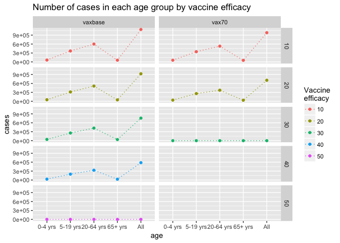<!-- -->

```r
# icer per daly averted
ggplot(age_df_vax70, aes(x = age, y = icer.daly.averted, color = v.eff, group = v.eff)) +
  geom_point() + geom_line(linetype = "dotted") + labs(color = "Vaccine \nefficacy") + t3
```

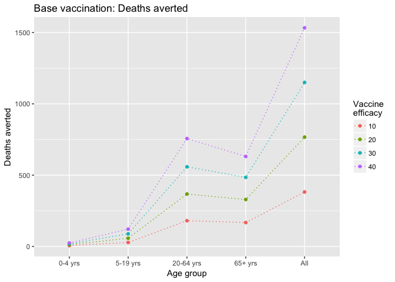<!-- -->

```r
#
g + aes(x = v.eff, y = icer.case.averted, group = risk, color = risk) + 
  geom_point() + geom_line(linetype = "dotted") + t1
```

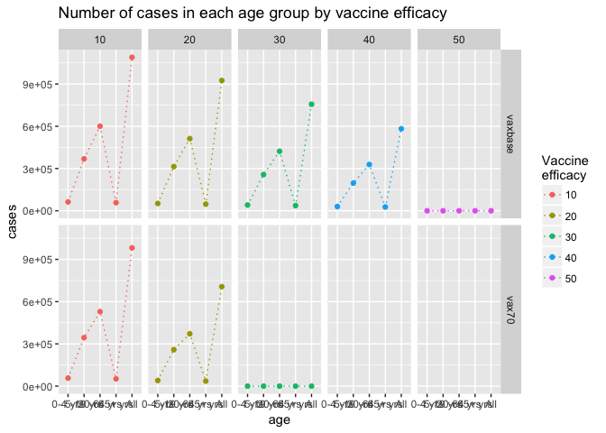<!-- -->

```r
g + aes(x = v.eff, y = icer.death.averted, group = risk, color = risk) + 
  geom_point() + geom_line(linetype = "dotted") + t2
```

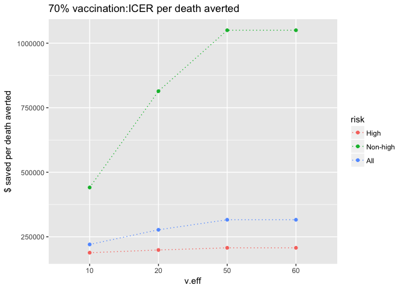<!-- -->

```r
g + aes(x = v.eff, y = icer.daly.averted, group = risk, color = risk) + 
  geom_point() + geom_line(linetype = "dotted") + t3
```

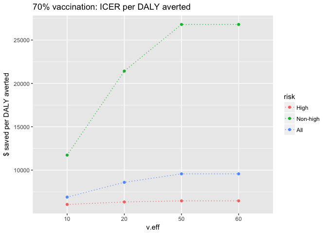<!-- -->


# Figure. Base case

```r
# Base case
```

# Figure. Base vax: Cases, cases averted

```r
# age groups
ggplot(age_df_base, aes(x = age, y = cases.per100k, group = v.eff, color = v.eff)) +
  geom_point() + geom_line(linetype = "dotted") + labs(color = "Vaccine \nefficacy") + 
  ylab("Cases per 100k") + ggtitle("Base vaccination: Cases per 100k")
```

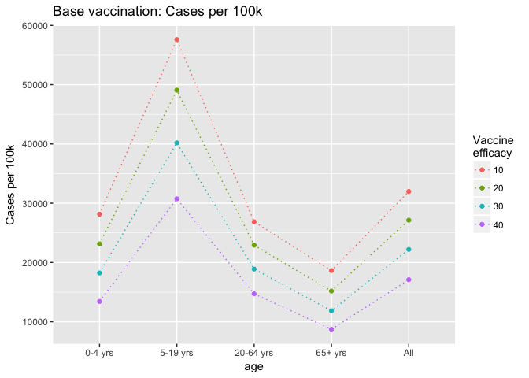<!-- -->

```r
ggplot(age_df_base, aes(x = age, y = cases.averted.per100k, group = v.eff, color = v.eff)) +
  geom_point() + geom_line(linetype = "dotted") + labs(color = "Vaccine \nefficacy") + 
  ylab("Cases per 100k") + ggtitle("Base vaccination: Averted cases per 100k")
```

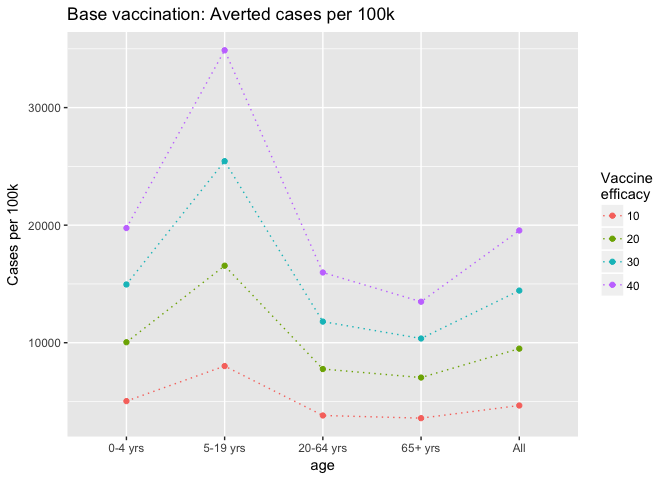<!-- -->

```r
# risk groups
ggplot(df_base, aes(x = age, y = cases.per100k, group = risk, color = risk)) +
  geom_point() + geom_line(linetype = "dotted") + labs(color = "Risk group") + 
  ylab("Cases per 100k") + ggtitle("Base vaccination: Number of cases per 100k") + facet_grid(~ v.eff)
```

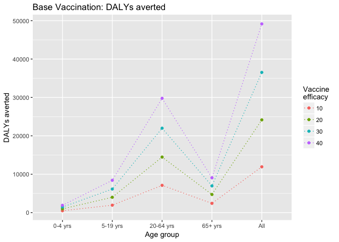<!-- -->

```r
ggplot(df_base, aes(x = age, y = cases.averted.per100k, group = risk, color = risk)) +
  geom_point() + geom_line(linetype = "dotted") + labs(color = "Risk group") + 
  ylab("Cases per 100k") + ggtitle("Base vaccination: Averted cases per 100k") + facet_grid(~ v.eff)
```

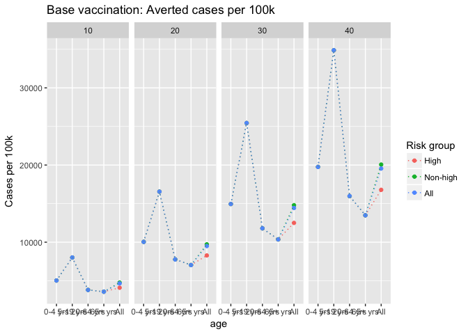<!-- -->

# Figure. 70% vax: Cases, cases averted

```r
# age groups
ggplot(age_df_vax70, aes(x = age, y = cases.per100k, group = v.eff, color = v.eff)) +
  geom_point() + geom_line(linetype = "dotted") + labs(color = "Vaccine \nefficacy") + 
  ylab("Cases per 100k") + ggtitle("70% vaccination: Number of cases per 100k")
```

<!-- -->

```r
ggplot(age_df_vax70, aes(x = age, y = cases.averted.per100k, group = v.eff, color = v.eff)) +
  geom_point() + geom_line(linetype = "dotted") + labs(color = "Vaccine \nefficacy") + 
  ylab("Cases per 100k") + ggtitle("70% vaccination: Averted cases per 100k")
```

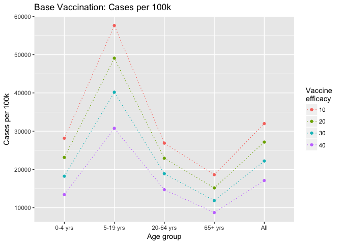<!-- -->

```r
# risk groups
ggplot(df_vax70, aes(x = age, y = cases.per100k, group = risk, color = risk)) +
  geom_point() + geom_line(linetype = "dotted") + labs(color = "Risk group") + 
  ylab("Cases per 100k") + ggtitle("70% vaccination: Number of cases per 100k") + facet_grid(~ v.eff)
```

<!-- -->

```r
ggplot(df_vax70, aes(x = age, y = cases.averted.per100k, group = risk, color = risk)) +
  geom_point() + geom_line(linetype = "dotted") + labs(color = "Risk group") + 
  ylab("Cases per 100k") + ggtitle("70% vaccination: Averted cases per 100k") + facet_grid(~ v.eff)
```

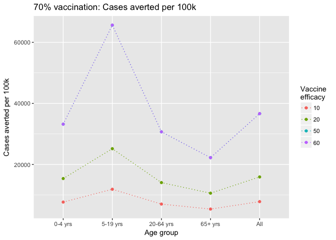<!-- -->

# Figure. Base vax: Deaths, deaths averted

```r
# age groups
ggplot(age_df_base, aes(x = age, y = deaths.per100k, group = v.eff, color = v.eff)) +
  geom_point() + geom_line(linetype = "dotted") + labs(color = "Vaccine \nefficacy") + 
  ylab("Deaths per 100k") + ggtitle("Base vaccination: Deaths per 100k")
```

<!-- -->

```r
ggplot(age_df_base, aes(x = age, y = deaths.averted.per100k, group = v.eff, color = v.eff)) +
  geom_point() + geom_line(linetype = "dotted") + labs(color = "Vaccine \nefficacy") + 
  ylab("Deaths per 100k") + ggtitle("Base vaccination: Averted deaths per 100k")
```

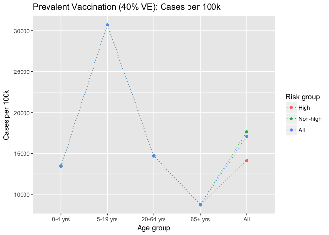<!-- -->

```r
# risk groups
ggplot(risk_df_base, aes(x = age, y = deaths.per100k, group = risk, color = risk)) +
  geom_point() + geom_line(linetype = "dotted") + labs(color = "Risk group") + 
  ylab("Deaths per 100k") + ggtitle("Base vaccination: Deaths per 100k") + facet_grid(~ v.eff)
```

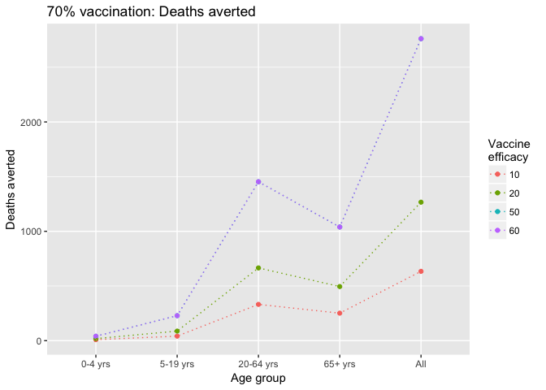<!-- -->

```r
ggplot(risk_df_base, aes(x = age, y = deaths.averted.per100k, group = risk, color = risk)) +
  geom_point() + geom_line(linetype = "dotted") + labs(color = "Risk group") + 
  ylab("Deaths per 100k") + ggtitle("Base vaccination: Averted deaths per 100k") + facet_grid(~ v.eff)
```

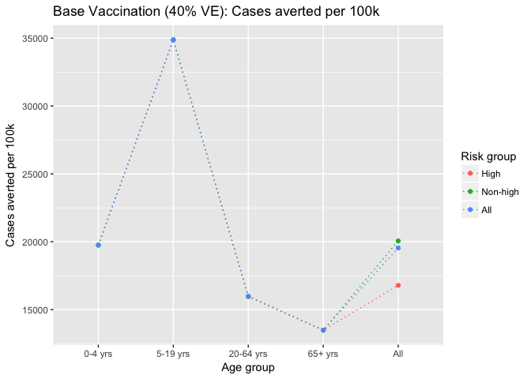<!-- -->

# Figure. 70% vax: Deaths, deaths averted

```r
# age groups
ggplot(age_df_vax70, aes(x = age, y = deaths.per100k, group = v.eff, color = v.eff)) +
  geom_point() + geom_line(linetype = "dotted") + labs(color = "Vaccine \nefficacy") + 
  ylab("Deaths per 100k") + ggtitle("70% vaccination: Deaths per 100k")
```

<!-- -->

```r
ggplot(age_df_vax70, aes(x = age, y = deaths.averted.per100k, group = v.eff, color = v.eff)) +
  geom_point() + geom_line(linetype = "dotted") + labs(color = "Vaccine \nefficacy") + 
  ylab("Deaths per 100k") + ggtitle("70% vaccination: Averted deaths per 100k")
```

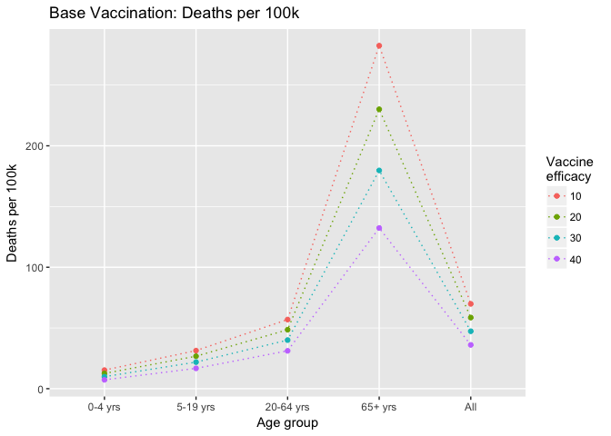<!-- -->

```r
# risk groups
ggplot(risk_df_vax70, aes(x = age, y = deaths.per100k, group = risk, color = risk)) +
  geom_point() + geom_line(linetype = "dotted") + labs(color = "Risk group") + 
  ylab("Deaths per 100k") + ggtitle("70% vaccination: Deaths per 100k") + facet_grid(~ v.eff)
```

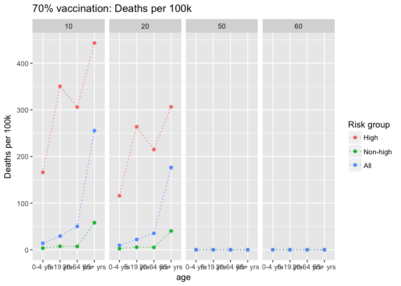<!-- -->

```r
ggplot(risk_df_vax70, aes(x = age, y = deaths.averted.per100k, group = risk, color = risk)) +
  geom_point() + geom_line(linetype = "dotted") + labs(color = "Risk group") + 
  ylab("Deaths per 100k") + ggtitle("70% vaccination: Averted deaths per 100k") + facet_grid(~ v.eff)
```

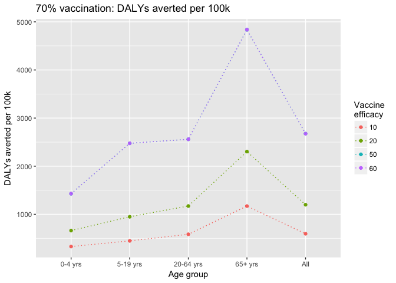<!-- -->

# Figure. Base vax: DALYs, DALYs averted

```r
# age groups
ggplot(age_df_base, aes(x = age, y = dalys.per100k, group = v.eff, color = v.eff)) +
  geom_point() + geom_line(linetype = "dotted") + labs(color = "Vaccine \nefficacy") + 
  ylab("DALYs per 100k") + ggtitle("Base vaccination: DALYs per 100k")
```

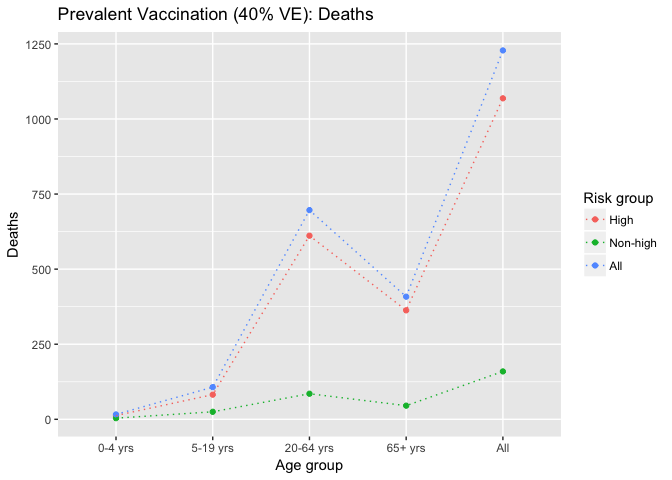<!-- -->

```r
ggplot(age_df_base, aes(x = age, y = dalys.averted.per100k, group = v.eff, color = v.eff)) +
  geom_point() + geom_line(linetype = "dotted") + labs(color = "Vaccine \nefficacy") + 
  ylab("DALYs per 100k") + ggtitle("Base vaccination: Averted DALYs per 100k")
```

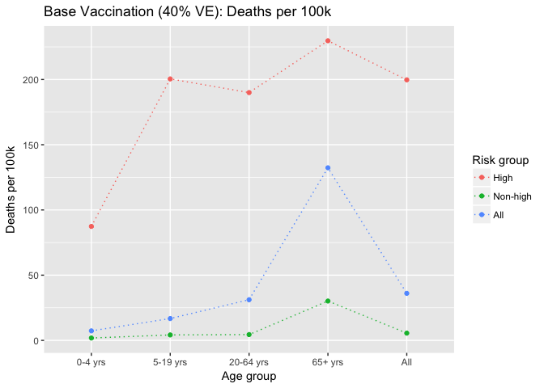<!-- -->

```r
# risk groups
ggplot(risk_df_base, aes(x = age, y = dalys.per100k, group = risk, color = risk)) +
  geom_point() + geom_line(linetype = "dotted") + labs(color = "Risk group") + 
  ylab("DALYs per 100k") + ggtitle("Base vaccination: DALYs per 100k") + facet_grid(~ v.eff)
```

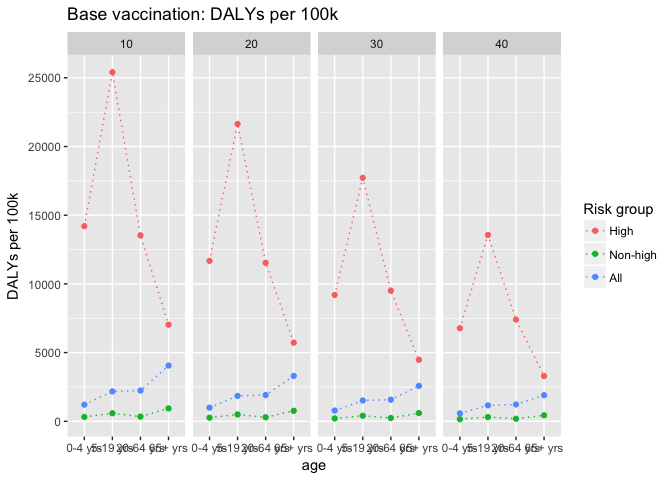<!-- -->

```r
ggplot(risk_df_base, aes(x = age, y = dalys.averted.per100k, group = risk, color = risk)) +
  geom_point() + geom_line(linetype = "dotted") + labs(color = "Risk group") + 
  ylab("DALYs per 100k") + ggtitle("Base vaccination: Averted DALYs per 100k") + facet_grid(~ v.eff)
```

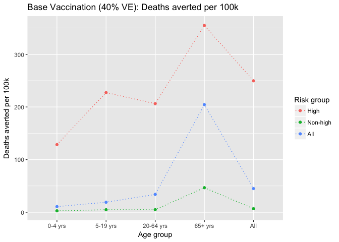<!-- -->

# Figure. 70% vax: DALYs, DALYs averted

```r
# age groups
ggplot(age_df_vax70, aes(x = age, y = dalys.per100k, group = v.eff, color = v.eff)) +
  geom_point() + geom_line(linetype = "dotted") + labs(color = "Vaccine \nefficacy") + 
  ylab("DALYs per 100k") + ggtitle("70% vaccination: DALYs per 100k")
```

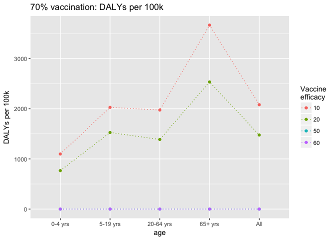<!-- -->

```r
ggplot(age_df_vax70, aes(x = age, y = dalys.averted.per100k, group = v.eff, color = v.eff)) +
  geom_point() + geom_line(linetype = "dotted") + labs(color = "Vaccine \nefficacy") + 
  ylab("DALYs per 100k") + ggtitle("70% vaccination: Averted DALYs per 100k")
```

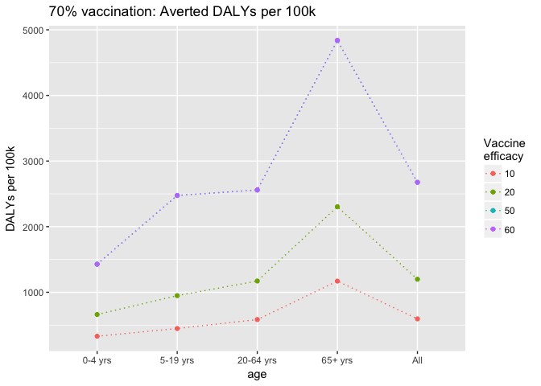<!-- -->

```r
# risk groups
ggplot(risk_df_vax70, aes(x = age, y = dalys.per100k, group = risk, color = risk)) +
  geom_point() + geom_line(linetype = "dotted") + labs(color = "Risk group") + 
  ylab("DALYs per 100k") + ggtitle("70% vaccination: DALYs per 100k") + facet_grid(~ v.eff)
```

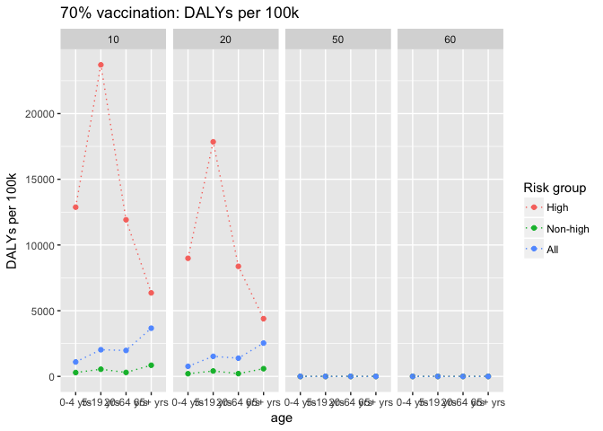<!-- -->

```r
ggplot(risk_df_vax70, aes(x = age, y = dalys.averted.per100k, group = risk, color = risk)) +
  geom_point() + geom_line(linetype = "dotted") + labs(color = "Risk group") + 
  ylab("DALYs per 100k") + ggtitle("70% vaccination: Averted DALYs per 100k") + facet_grid(~ v.eff)
```

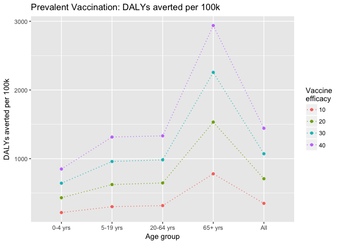<!-- -->

# Alternatively
### Cases per 100k


### Deaths per 100k


### DALYs per 100k


### Base vax: Cases


### Base vax: Deaths


### Base vax: DALYs


### Vax 70%: Cases


### Vax 70%: Deaths


### Vax 70%: DALYs


